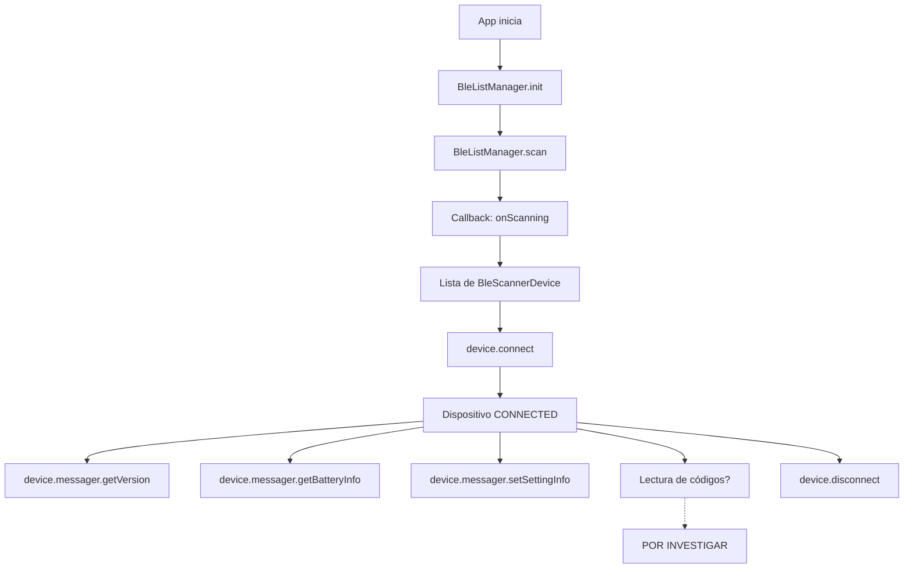

# FASE 1: INVESTIGACIÓN Y PREPARACIÓN - COMPLETADA ✅

## Fecha de completitud: 2025-12-15

---

## 📦 ARTEFACTOS OBTENIDOS

### 1. SDK de Inatek clonado
**Ubicación:** `InateckSDK/`
**Origen:** https://github.com/Inateck-Technology-Inc/android_sdk

### 2. Archivos JAR identificados y organizados
**Ubicación:** `InateckSDK/libs-for-binding/`

| Archivo | Tamaño | Propósito |
|---------|--------|-----------|
| `inateck-scanner-ble-2-0-0.jar` | 108 KB | SDK principal de Inatek |
| `jna-min.jar` | 212 KB | Dependencia JNA (parsing nativo) |
| `jna-platform.jar` | 1.4 MB | Dependencia JNA Platform |

### 3. Documentación generada
- ✅ [API_MAPPING.md](API_MAPPING.md) - Mapeo completo de la API del SDK
- ✅ [FASE_1_RESUMEN.md](FASE_1_RESUMEN.md) - Este documento

---

## 🔍 HALLAZGOS CLAVE

### API Principal del SDK

#### Clase: `BleListManager`
- **Inicialización**: `BleListManager.init(Application)`
- **Escaneo**: `scan(BleScanResultCallBack)`, `stopScan()`
- **Gestión**: Lista de dispositivos encontrados, handler de desconexiones

#### Clase: `BleScannerDevice`
- **Propiedades**: `name`, `mac`, `connectState`, `messager`
- **Métodos**: `connect()`, `disconnect()`, `setMTU()`
- **Estados**: CONNECTING, CONNECTED, DISCONNECTING, DISCONNECTED, UNKNOWN

#### Clase: `BleMessager`
- **Información**: `getVersion()`, `getHardwareInfo()`, `getBatteryInfo()`
- **Configuración**: `getSettingInfo()`, `setSettingInfo()`
- **Comunicación**: `sendData()`

### Callbacks identificados
1. `BleScanResultCallBack` - Eventos de escaneo
2. `BleConnectResultCallBack` - Eventos de conexión (disponible pero no usado en demo)

---

## 🔧 DEPENDENCIAS EXTERNAS

### Maven/Gradle
```kotlin
implementation("com.github.Jasonchenlijian:FastBle:2.4.0")
implementation("com.google.code.gson:gson:2.8.9")
```

### Bibliotecas incluidas (JARs)
- JNA (Java Native Access) para procesamiento de comandos nativos

---

## 🔐 PERMISOS REQUERIDOS

### Android Manifest
```xml
<!-- Localización (requerido para BLE) -->
<uses-permission android:name="android.permission.ACCESS_FINE_LOCATION" />
<uses-permission android:name="android.permission.ACCESS_COARSE_LOCATION" />

<!-- Bluetooth Legacy -->
<uses-permission android:name="android.permission.BLUETOOTH" />
<uses-permission android:name="android.permission.BLUETOOTH_ADMIN" />

<!-- Bluetooth (Android 12+) -->
<uses-permission android:name="android.permission.BLUETOOTH_SCAN" />
<uses-permission android:name="android.permission.BLUETOOTH_CONNECT" />
<uses-permission android:name="android.permission.BLUETOOTH_ADVERTISE" />
```

---

## 📊 FLUJO DE USO IDENTIFICADO



---

## ⚠️ LIMITACIONES Y PENDIENTES

### 1. ❓ Lectura de códigos de barras no documentada
**Problema:** No se encontró en el código demo un callback específico para recibir códigos escaneados.

**Hipótesis:**
- Podría usar `BleMessager.sendData()` para enviar datos leídos
- Podría haber características BLE específicas no mostradas en el demo
- Podría requerir suscripción a notificaciones BLE del dispositivo

**Acción requerida:** Investigar protocolo BLE del BCST-75S en la documentación completa

### 2. 🔄 Dependencia de FastBle
- SDK depende de biblioteca externa de BLE
- Debe incluirse en el binding o buscar alternativa en .NET

### 3. 📡 Características BLE no documentadas
- UUIDs de servicios y características no identificados en el código demo
- Posible MTU requerido específico (método `setMTU()` existe)

---

## ✅ VALIDACIONES COMPLETADAS

- [x] SDK clonado exitosamente
- [x] Archivos JAR localizados (3 archivos)
- [x] Código demo analizado (MainActivity.kt, DeviceDetailActivity.kt)
- [x] API pública documentada (10+ clases principales)
- [x] Callbacks identificados (2 interfaces)
- [x] Permisos Android listados (7 permisos)
- [x] Dependencias externas identificadas (FastBle, Gson, JNA)
- [x] Flujo de uso reconstruido
- [x] Formato de configuración JSON documentado

---

## 📁 ESTRUCTURA DE ARCHIVOS ACTUAL

```
Inatek/
├── docs/
│   ├── API_MAPPING.md          ✅ Mapeo completo de API
│   └── FASE_1_RESUMEN.md       ✅ Este documento
├── InateckSDK/                 ✅ Repositorio clonado
│   ├── app/
│   │   ├── libs/
│   │   │   ├── inateck-scanner-ble-2-0-0.jar
│   │   │   ├── jna-min.jar
│   │   │   └── jna-platform.jar
│   │   ├── src/main/java/com/example/android_sdk_demo/
│   │   │   ├── MainActivity.kt          ✅ Analizado
│   │   │   └── DeviceDetailActivity.kt  ✅ Analizado
│   │   └── build.gradle.kts             ✅ Analizado
│   └── libs-for-binding/       ✅ JARs listos para binding
│       ├── inateck-scanner-ble-2-0-0.jar
│       ├── jna-min.jar
│       └── jna-platform.jar
└── README.md (pendiente)
```

---

## 🎯 PRÓXIMOS PASOS (FASE 2)

### 2.1 Crear Android Binding Library
- [ ] Crear proyecto `InateckBinding.csproj`
- [ ] Incluir JAR principal como `EmbeddedJar`
- [ ] Incluir JNA JARs como `EmbeddedJar`
- [ ] Crear `Metadata.xml` inicial
- [ ] Compilar binding (primera iteración)

### 2.2 Resolver conflictos de binding
- [ ] Analizar errores de compilación
- [ ] Ajustar transformaciones en `Metadata.xml`
- [ ] Verificar generación de clases C#

### 2.3 Crear wrapper C#
- [ ] Implementar `InateckScannerWrapper.cs`
- [ ] Convertir callbacks a eventos C#
- [ ] Implementar métodos async
- [ ] Manejo de errores

### 2.4 Investigar lectura de códigos
- [ ] Revisar documentación completa en docs.inateck.com
- [ ] Probar app demo en dispositivo físico
- [ ] Capturar tráfico BLE si es necesario
- [ ] Documentar protocolo de lectura

---

## 📞 RECURSOS Y CONTACTOS

**Documentación oficial:**
- SDK Android: https://github.com/Inateck-Technology-Inc/android_sdk
- Docs generales: https://docs.inateck.com/scanner-sdk-en/

**Soporte técnico:**
- Email: support@inateck.com (según documentación)

**Modelo del dispositivo:**
- Marca: Inatek
- Modelo: BCST-75S
- Tipo: Escáner de códigos de barras Bluetooth

---

## 📝 NOTAS DEL DESARROLLADOR

### Observaciones positivas
1. ✅ SDK bien estructurado en Kotlin
2. ✅ Código demo funcional y claro
3. ✅ Uso de Result<T> para manejo de errores
4. ✅ API relativamente simple y directa

### Observaciones de mejora
1. ⚠️ Falta documentación de lectura de códigos
2. ⚠️ No hay ejemplos de suscripción a notificaciones BLE
3. ⚠️ Dependencia de biblioteca externa (FastBle)

### Recomendaciones
- Contactar a Inatek para documentación completa del protocolo BLE
- Considerar ingeniería inversa del tráfico BLE si es necesario
- Probar con dispositivo físico lo antes posible para validar lectura

---

**FASE 1: COMPLETADA CON ÉXITO ✅**

*Tiempo estimado: ~2 horas*
*Próxima fase: FASE 2 - Android Binding Library*
